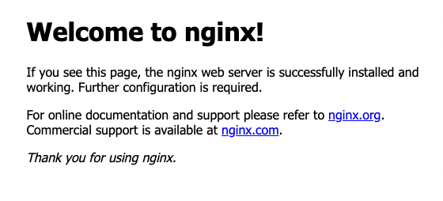
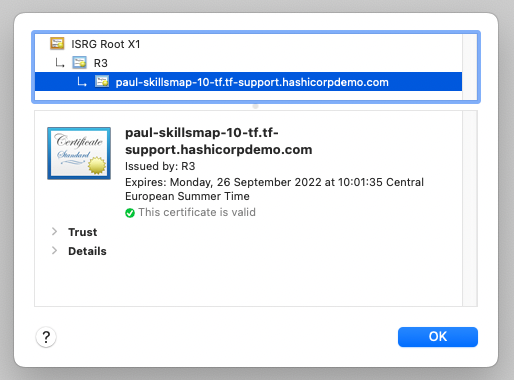

# skillsmap-infra-10
Skillsmap cloud/infra tab, exercise line 10

# Task
on AWS.  
create VPC.  
create 2 subnets, one for public network, one for private network.  
create internet gw and connect to public network.  
create nat gateway, and connect to private network.  
create Auto scaling group for app, ec2 only private subnet.  
create a LB on https (check Application Load Balancer or Network Load Balancer).  
publish a service over LB, ie nginx.  

# Usage
Git clone
```
git clone https://github.com/paulboekschoten/skillsmap-infra-10.git
```

Change directory
```
cd skillsmap-infra-10
```

# Check variables are correct in terraform.tfvars  
Set your values for cert_email, route53_zone and route53_subdomain.
```
cert_email        = "paul.boekschoten@hashicorp.com"
route53_zone      = "tf-support.hashicorpdemo.com"
route53_subdomain = "paul-skillsmap-10-tf"
```  
  

# Terraform init
Initialise Terraform with the following command  
```
terraform init
```
Sample output
```
Initializing the backend...

Initializing provider plugins...
- Finding vancluever/acme versions matching "2.8.0"...
- Finding latest version of hashicorp/aws...
- Finding latest version of hashicorp/tls...
- Using vancluever/acme v2.8.0 from the shared cache directory
- Using hashicorp/aws v4.20.1 from the shared cache directory
- Using hashicorp/tls v3.4.0 from the shared cache directory

Terraform has created a lock file .terraform.lock.hcl to record the provider
selections it made above. Include this file in your version control repository
so that Terraform can guarantee to make the same selections by default when
you run "terraform init" in the future.

Terraform has been successfully initialized!

...
```
  

# Terraform apply
Apply the Terraform configuration changes  
```
terraform apply
```
Sample output
```
...

Plan: 27 to add, 0 to change, 0 to destroy.

Changes to Outputs:
  + url = (known after apply)

Do you want to perform these actions?
  Terraform will perform the actions described above.
  Only 'yes' will be accepted to approve.

  Enter a value:  

```

Answer with `yes` if your want to proceed.  

```
...

acme_certificate.certificate: Still creating... [1m0s elapsed]
acme_certificate.certificate: Still creating... [1m10s elapsed]
acme_certificate.certificate: Still creating... [1m20s elapsed]
acme_certificate.certificate: Creation complete after 1m26s [id=99a50c6e-13d4-b95b-52a0-a54dd56a6b0c]
aws_acm_certificate.cert: Creating...
aws_acm_certificate.cert: Creation complete after 0s [id=arn:aws:acm:eu-west-3:323533494701:certificate/37172b14-6045-473e-9b7b-26afed024bab]
aws_lb_listener.https: Creating...
aws_lb_listener.https: Creation complete after 0s [id=arn:aws:elasticloadbalancing:eu-west-3:323533494701:listener/app/paul-skillsmap-10-tf/8c8bc4e8fa3ca01b/acc44f25ad330b01]

Apply complete! Resources: 27 added, 0 changed, 0 destroyed.
```

# Output  
At the end you will also see an output  
```
Outputs:

url = "https://paul-skillsmap-10-tf.tf-support.hashicorpdemo.com/"
```

If you visit this link on https ([https://paul-skillsmap-10-tf.tf-support.hashicorpdemo.com/](https://paul-skillsmap-10-tf.tf-support.hashicorpdemo.com/)) you should see this  
   

With a valid certificate  
    

# TODO


# DONE
- [x] Create VPC
- [x] Create Subnets
- [x] Create Internet Gateway
- [x] Create NAT gateway
- [x] Create Security Groups
- [x] Create Route Tables
- [x] Create Security Group Rules
- [x] Create Target Group
- [x] Create Load Balancer
- [x] Route 53 entry
- [x] Create HTTPS Certificate
- [x] Create Listener
- [x] Create Launch Configuration
- [x] Create Autoscaling Group
- [x] Destroy/apply