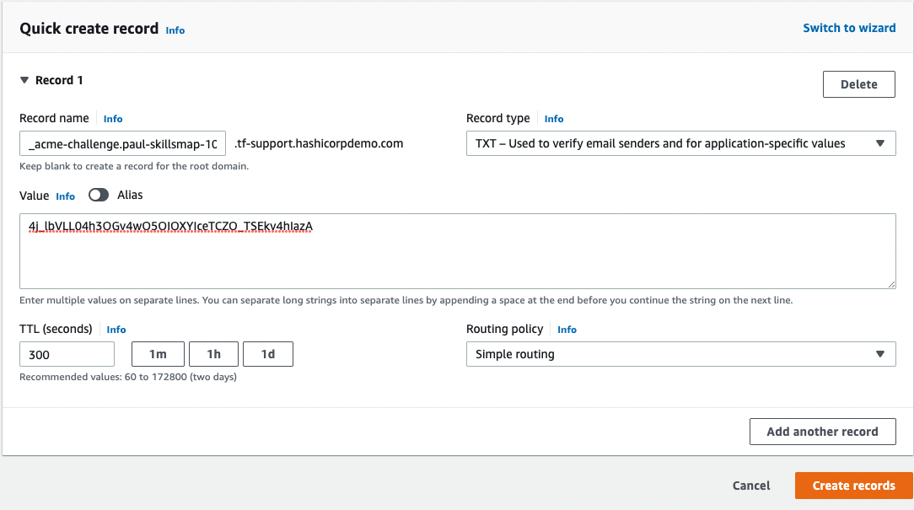
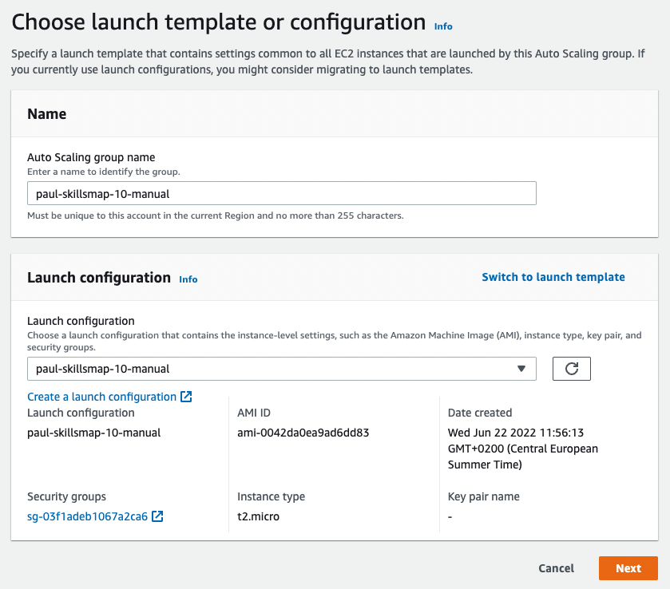

# Task
on AWS.  
create VPC.  
create 2 subnets, one for public network, one for private network.  
create internet gw and connect to public network.  
create nat gateway, and connect to private network.  
create Auto scaling group for app, ec2 only private subnet.  
create a LB on https (check Application Load Balancer or Network Load Balancer).  
publish a service over LB, ie nginx.  


Region: eu-west-3  

# VPC
Go to VPC  
Create VPC  
  

# Subnets
Go to subnets
Select newly created VPC  
  
Do the same for paul-skillsmap-10-manual-public1 with cidr range 10.0.1.0/24  
Do the same for paul-skillsmap-10-manual-public2 with cidr range 10.0.2.0/24, select a different Availability Zone to the previous public subnet.  

# Internet Gateway
Go to Internet Gateways
Create  
  
Under actions, click attach to VPC  
Select your VPC and attach.  

# NAT Gateway
Go to NAT Gateways
Create  
  
Click Allocate Elastic IP to get a new public IP address.  

# Security Groups
Go to Security Groups  
## Public
Create  
  
Select your VPC  
Add Inbound HTTPS rule for cidr 0.0.0.0/0  
## Private
Create  
  
Select your VPC  
Create an inbound rule for all traffic.  
Select the previously made security group in the inbound rule.  

# Route tables
Go to Route tables
Find the route table automatically created with VPC  
Edit routes  
Add route to your Internet Gateway:  
  

Add another route table  
  
Select your VPC  

Under Actions, click Edit Subnet Associations  
  
Associate with the private subnet  

Got to Edit Routes  
  
Add route to the NAT gateway  

# Target Group
Go to Target Groups  
Create  
  
Next  
Create  

# Load Balancer  
Go to Load Balancers  
Select Application load balancer  
  


Select your vpc  
Select the 2 Availability Zones, and their public subnets.  

  
Remove the default security group  
Select the public security group  

  
Select the target group  
Create

  
paul-skillsmap-10-manual-1890740303.eu-west-3.elb.amazonaws.com

# DNS
Go to Route 53  
Hosted Zones  
tf-support.hashicorpdemo.com  
Create record  
  
Toggle alias  
Select Alias to application load balancer  
Select region  
Select the loadbalancer  
Create  

# Lets Encrypt Certificate
On a UNIX machine with certbot installed  
```
sudo certbot -d paul-skillsmap-10-manual.tf-support.hashicorpdemo.com --manual --preferred-challenges dns certonly --register-unsafely-without-email
```
Accept Terms  
  
Place the challenge in Route 53 as described  
Move the created files to an accessible location and make available for upload.  
Files will be available via shortcuts in a directory like  
```
/etc/letsencrypt/live/paul-skillsmap-10-manual.tf-support.hashicorpdemo.com/
```

# Listener
Go to the loadbalancer  
Go to the tab Listeners  
Add Listener  
  
Select HTTPS  
Select Forward as Action  
Select the target group  

  
Select Import instead of From ACM  
Copy the contents of the requested files from Lets Encrypt into the corresponding text inputs.  
Add  

Delete listener for HTTP on port 80  

# Launch configuration
Go to Launch Configurations  
Create  
  
Use image ami-0042da0ea9ad6dd83  
Select t2.micro as instance type  

Under additional configuration, unfold advanced   
  

Under user data fill in:
```bash
#!/bin/bash
sudo apt-get install -y nginx
```
Select Do not assign public ip address  

Under security groups  

Select existing, and select the private security group  

Under Key Pair  
  
Select Proceed without and acknowledge.  

Click Create 


# Auto Scaling Group
Go to Auto Scaling Groups  
Create  
  
Click Switch to launch configuration  
Select the launch configuration  
Next  

  
Select the vpc  
Select the private subnet  
Next  

  
Select Attach to an existing loadbalancer  
Select choose from your loadbalancer target groups  
Select the HTTP target group  

  
Enable ELB
Next  

  
Set the desired group size  
Next  
Next  
Next  
Create  


# Check
Go to [https://paul-skillsmap-10-manual.tf-support.hashicorpdemo.com/](https://paul-skillsmap-10-manual.tf-support.hashicorpdemo.com/)  
Check the padlock in the browser is closed and the certificate valid.  
  